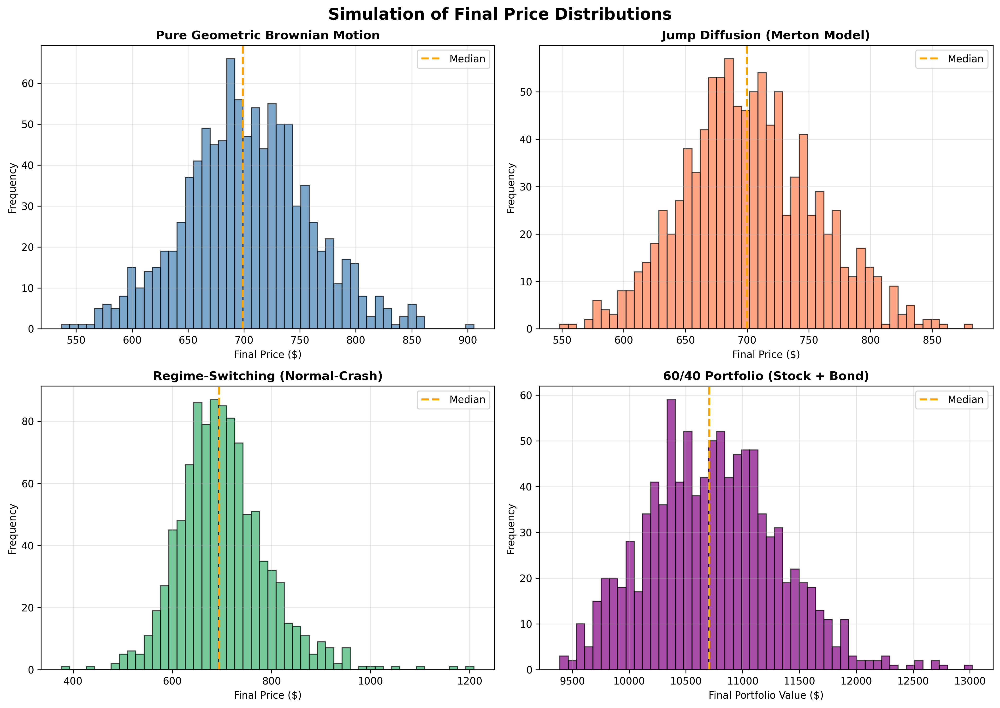
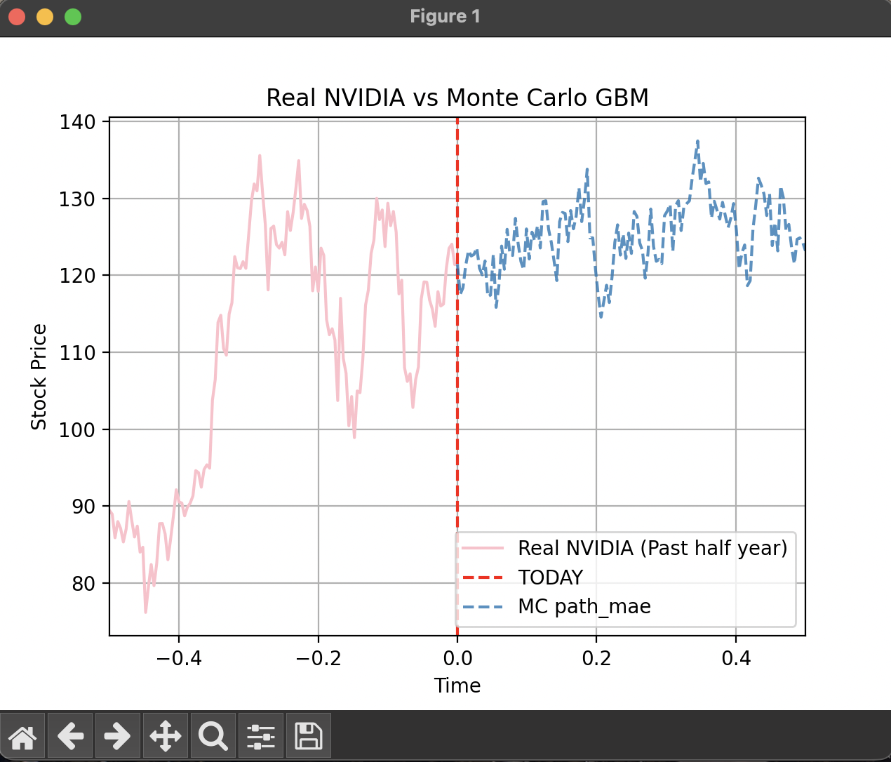

# mc_stock_sim
A C++ stock price simulator based on stochastic processes (Geometric Brownian motion). Historical market data is loaded from CSV files to estimate drift and volatility, and simulation results are exported for further analysis and visualisation.

---

## Models

### 1. Geometric Brownian Motion (GBM)

Baseline model with constant drift and volatility, log-normally distributed price changes.

```
d(ln S) = (μ − σ²/2) dt + σ dW
```

---

### 2. Jump Diffusion (Merton Model)

Extends GBM with a compound Poisson process to capture sudden large price moves.

```
d(ln S) = (μ − σ²/2 − λκ) dt + σ dW + J dN
```

Jumps are calibrated from historical daily log returns using a Z-score threshold (default 2.5σ). 

---

### 3. Regime-Switching (Hamilton Model)

Models the market as alternating between two latent states — **Normal** and **Crash** — each with its own drift and volatility, governed by a first-order Markov chain. States are identified by K-means clustering on rolling volatility.

---

### 4. Portfolio Simulation (60/40 Stock + Bond)
Combines a stock position (GBM) with a bond position priced using the **Vasicek interest rate model**, allocated at a configurable stock/bond split (default 60/40).

```
Bond price: P(t,T) = A(t,T) · e^(−B(t,T)·r_t)
r_t follows: dr = κ(θ − r) dt + σ_r dW
```
---

## Simulation Results



*Figure 1: Final price distributions across all four models from simulation*
   

   
*Figure 2: Comparison of real NVIDIA stock prices (past 6 months) vs Monte Carlo GBM simulation*

---

## Option Pricing

European call and put options are priced under the **risk-neutral measure** using Monte Carlo simulation and compared against analytical Black-Scholes prices.

The option value is the discounted expected payoff:

```
V₀ = e^(−rT) · E^Q[ payoff(S_T) ]
```

---

## Prerequisites

- C++17 compiler (GCC 11+ or Clang 14+)
- Intel TBB (`std::execution::par` support)
  - macOS: `brew install tbb`
  - Linux: `sudo apt install libtbb-dev`
- Python 3.7+ with `yfinance` — for fetching market data
  - `pip install yfinance`

---

## Setup

```bash
git clone https://github.com/xqxiang06/mc_stockSim.git
cd mc_stockSim
```

---

## Get Data

Download historical price data for any ticker before running the simulator:

```bash
# NVIDIA — last 2 years (default)
python fetch_data.py NVDA

# Any ticker, custom date range
python fetch_data.py AAPL -s 2022-01-01 -e 2024-12-31

# Maximum available history
python fetch_data.py TSLA -p max

# Custom output path
python fetch_data.py NVDA -p 5y -o data/nvda_stock.csv
```

Output lands in `data/<TICKER>_STOCK_DATA.csv` by default. If you change the ticker or filename, update `csv_file` at the top of `main.cpp` to match.

---

## Build & Run

```bash
make            # compile → bin/monte_carlo_sim
make run        # build (if needed) + run
make debug      # rebuild with -g -O0 for debugging
make clean      # remove object files and binary
make clean-all  # also remove generated CSVs in data/
```

Override the compiler if needed:

```bash
make CXX=clang++
```

---

## Configuration

All user-facing parameters live at the top of `main()` in `main.cpp`:

| Parameter | Default | Description |
|-----------|---------|-------------|
| `csv_file` | `data/nvda_stock.csv` | Path to historical price data |
| `lookback_days` | 126 | Trading days used for GBM/jump calibration |
| `regime_lookback_days` | 252 | Trading days used for regime calibration |
| `n_paths` | 1,000,000 | Number of Monte Carlo paths |
| `n_steps` | 126 | Time steps per path (daily for 6 months) |
| `T` | 0.5 | Simulation horizon in years |
| `jump_threshold` | 2.5 | Z-score cutoff for classifying jumps |
| `r` | 0.045 | Risk-free rate for option pricing |
| `stock_weight` | 0.6 | Portfolio stock allocation |